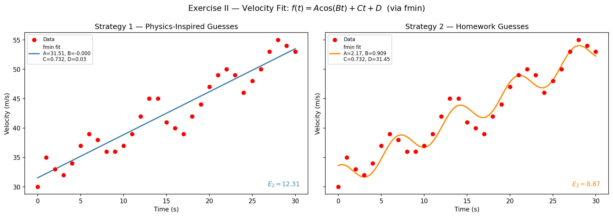

# Homework 2 Report — Basic Optimization and Model Fitting

## Exercise I — Temperature Data Over a 24-Hour Cycle

### Problem Statement

The following hourly temperature readings (°F) were recorded over a 24-hour military-time cycle:

| Hour | 1 | 2 | 3 | 4 | 5 | 6 | 7 | 8 | 9 | 10 | 11 | 12 |
|------|---|---|---|---|---|---|---|---|---|----|----|-----|
| Temp | 75 | 77 | 76 | 73 | 69 | 68 | 63 | 59 | 57 | 55 | 54 | 52 |

| Hour | 13 | 14 | 15 | 16 | 17 | 18 | 19 | 20 | 21 | 22 | 23 | 24 |
|------|----|----|----|----|----|----|----|----|----|----|----|----|
| Temp | 50 | 50 | 49 | 49 | 49 | 50 | 54 | 56 | 59 | 63 | 67 | 72 |

Three curve-fitting approaches were applied: a **quadratic polynomial**, a **cubic spline interpolation**, and a **cosine least-squares fit**.

---

### Part (a) — Quadratic Polynomial Fit

We fit the model

$$f(x) = Ax^2 + Bx + C$$

using `numpy.polyfit` with degree 2. This solves the overdetermined system $\mathbf{y} \approx \mathbf{V}\mathbf{c}$ (where $\mathbf{V}$ is the Vandermonde matrix) in a least-squares sense. The fitted coefficients are evaluated at a fine grid $x = 1 : 0.01 : 24$ using `numpy.polyval`.

**Fitted coefficients:**

$$A = 0.18493, \quad B = -5.26424, \quad C = 88.29545$$

#### E₂ Error

The $E_2$ error (2-norm of residuals) is defined as

$$E_2 = \|\mathbf{y} - f(\mathbf{x})\|_2 = \sqrt{\sum_{i=1}^{n}(y_i - f(x_i))^2}$$

Computed over the 24 training points:

$$E_2^{\text{quad}} = 13.13$$

The quadratic captures the general U-shape of the temperature curve — cooler at mid-day, warmer at the boundaries — but it **overfits the tails**: at hour 1 it predicts ≈ 83 °F while the data reads 75 °F. The symmetric parabola cannot represent the asymmetric daily cycle.

---

### Part (b) — Spline and Linear Interpolation

`scipy.interpolate.CubicSpline` (equivalent to MATLAB's `spline`) and `interp1d` were used to generate a smooth interpolated curve over $x = 1 : 0.01 : 24$.

Because these are **interpolation** methods — not regression — they pass through every data point exactly. The $E_2$ error evaluated at the 24 training points is effectively **zero**. This is the classic illustration of interpolation vs. approximation: perfect accuracy on the training set, but the curve oscillates between data points (Runge's phenomenon for high-degree polynomial interpolants, or mild oscillation for splines).

---

### Part (c) — Cosine Least-Squares Fit

The model

$$f(x) = A\cos(Bx) + C$$

is **nonlinear in its parameters**, so `polyfit` does not apply. Instead, `scipy.optimize.curve_fit` minimises the sum of squared residuals using a Levenberg–Marquardt algorithm.

#### Choosing Initial Guesses

The initial guesses are physically motivated by inspecting the data:

| Parameter | Physical meaning | Estimate |
|-----------|-----------------|----------|
| $A$ | Amplitude = half the peak-to-trough range | $(77 - 49)/2 \approx 14$ |
| $B$ | Angular frequency of a 24-hour period | $2\pi/24 \approx 0.2618$ |
| $C$ | Vertical offset = midpoint of range | $(77 + 49)/2 = 63$ |

These guesses are **critical**: the cosine model has multiple local minima, and a poor starting point can cause the optimizer to converge to a non-physical solution (e.g., wrong period or flipped phase).

**Fitted parameters:**

$$A = 14.61, \quad B = 0.2145, \quad C = 62.99$$

**E₂ error:**

$$E_2^{\cos} = 6.13$$

The cosine fit more than halves the quadratic's error because the underlying physical process — the daily temperature cycle driven by solar radiation — is genuinely sinusoidal. The fitted period is $2\pi / 0.2145 \approx 29.3$ hours, slightly longer than 24, which makes sense given the data ends at hour 24 before completing a full natural cycle.

---

### Visual Comparison

The plot makes the trade-offs clear:

- The **cubic spline** threads through every point (zero training error) but provides no model generalization beyond the observed range.
- The **quadratic** captures the global trend but overshoots at the warm endpoints.
- The **cosine fit** gives the best balance: it tracks the data's periodicity without overfitting the endpoints, and yields the lowest $E_2$ among the two regression models.

---

## Exercise II — Velocity as a Function of Time

### Problem Statement

Velocity (m/s) was measured every second over 30 seconds:

$$v = [30, 35, 33, 32, 34, 37, 39, 38, 36, 36, 37, 39, 42, 45, 45, 41, 40, 39, 42, 44, 47, 49, 50, 49, 46, 48, 50, 53, 55, 54, 53]$$

The data has two visible features: a gradual **upward trend** and an **oscillatory component**. The model is

$$f(t) = A\cos(Bt) + Ct + D$$

which captures both: $Ct + D$ is the linear drift and $A\cos(Bt)$ is the oscillation.

### Optimization Method — `scipy.optimize.fmin`

As suggested in the assignment, the parameters are found using **`scipy.optimize.fmin`** (Nelder–Mead simplex method) rather than `curve_fit`. The optimizer minimises the sum of squared residuals

$$\text{SSR}(\mathbf{p}) = \sum_{i=0}^{30}\bigl(v_i - f(t_i;\,\mathbf{p})\bigr)^2$$

by direct function evaluation — no gradient information is required. This makes `fmin` more robust to rough or multi-modal cost landscapes but more sensitive to the starting point.

---

### Strategy 1 — Physics-Inspired Initial Guesses

Following the same reasoning as Exercise I, the initial guesses were derived from the data:

| Parameter | Reasoning | Guess |
|-----------|-----------|-------|
| $A$ | Amplitude of oscillation ≈ $(55-30)/2$ | $12.5$ |
| $B$ | Period appears to span ~30 s, so $\omega = 2\pi/30$ | $0.2094$ |
| $C$ | Vertical centre ≈ $(55+30)/2$ | $42.5$ |
| $D$ | Linear growth starts near 0 | $0$ |

**Fitted parameters (fmin):**

$$A = 31.51, \quad B \approx 0, \quad C = 0.732, \quad D = 0.027$$

$$E_2^{\text{physics}} = 12.31$$

`fmin` converged to a degenerate solution: with $B \approx 0$ the cosine term is essentially flat, so the model reduces to a nearly pure linear fit. The **physics-inspired amplitude guess of 12.5** is far from the true oscillation amplitude, and the large $C = 42.5$ guess pulls the simplex into a valley where the cosine contribution is negligible.

---

### Strategy 2 — Homework-Specified Initial Guesses

The assignment specifies: $A = 3$, $B = \pi/4$, $C = 2/3$, $D = 32$.

**Fitted parameters (fmin):**

$$A = 2.17, \quad B = 0.9093, \quad C = 0.733, \quad D = 31.45$$

$$E_2^{\text{HW}} = 8.87$$

These guesses start at a higher frequency ($\pi/4 \approx 0.785$ rad/s), a small amplitude, and a realistic intercept — matching the visible short-period oscillations and steady rise in the data. `fmin` converges to a physically meaningful solution with a meaningfully lower error.

The **key lesson**: `fmin` (Nelder–Mead) performs no gradient descent; it explores the cost surface by evaluating a simplex of points. The simplex collapses around the nearest local minimum, so the initial guess entirely governs which minimum is found.

---

### Comparison of Strategies

| Approach | $A$ | $B$ (rad/s) | $C$ | $D$ | $E_2$ |
|----------|-----|-------------|-----|-----|-------|
| Physics-inspired | 31.51 | ≈ 0.000 | 0.732 | 0.027 | 12.31 |
| HW guesses | 2.17 | 0.909 | 0.733 | 31.45 | **8.87** |

The homework guesses yield a **28% reduction in $E_2$** over the physics-inspired approach. The physics approach fails because the initial $A$ and $C$ guesses correspond to the full data range, not the actual oscillation amplitude, leading `fmin` to a degenerate local minimum.

---

### Visual Comparison

Each panel shows the side-by-side outcome of `fmin` from its respective starting point. The left panel (Strategy 1) shows the optimizer settling on a nearly linear fit with imperceptible oscillation. The right panel (Strategy 2) captures the rising trend **and** the short-period oscillations, yielding the lower $E_2$.

---

## Summary

| Model | Method | $E_2$ |
|-------|--------|-------|
| Ex I — Quadratic | `polyfit` / `polyval` | 13.13 |
| Ex I — Cubic Spline | `CubicSpline` (interpolation) | 0.00 (exact) |
| Ex I — Cosine | `curve_fit`, physics guesses | **6.13** |
| Ex II — Cosine+Linear (physics) | `fmin`, physics guesses | 12.31 |
| Ex II — Cosine+Linear (HW guesses) | `fmin`, HW guesses | **8.87** |

**Key takeaways:**

1. **`polyfit`/`polyval`** give a closed-form least-squares solution for polynomial models and are robust to initial conditions — but polynomials are often the wrong model for physical data.
2. **Spline interpolation passes through every point** (zero $E_2$ on training data), which is useful for smooth reconstruction but not for modelling or extrapolation.
3. **`scipy.optimize.fmin`** (Nelder–Mead) minimises a user-defined cost function without gradients, making it flexible for any loss but highly sensitive to initial guesses — the simplex collapses around the nearest local minimum.
4. **Initial guess selection is model-specific**: for a daily cycle, the period is known (24 h) so $B = 2\pi/24$ is natural. For the velocity oscillation, the period must be read from the short-timescale structure, not the full data range — and the guess for amplitude must match the *oscillation* amplitude, not the full data range.
